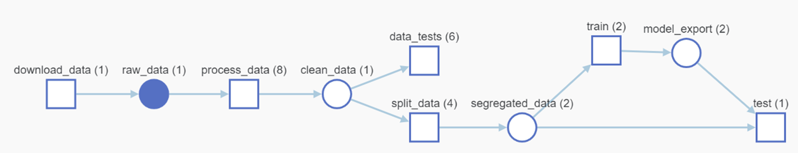

Genre Classification with MLOps
==============================
[](https://github.com/psf/black)

- [Origin](https://github.com/HeberTU/genre-classification-MLOps)
- Author: Heber Trujillo <heber.trj.urt@gmail.com>
- Date of last README.md update: 01.04.2022

## Repo Overview

This repository shows how to implement an end-to-end machine learning (ML) pipeline using [mlflow](https://mlflow.org/) 
and [W&B](https://wandb.ai/site).

The following directional graph shows the implemented ML-pipeline:



Which contains the following components:

- download data: Upload the file from the provided url as an artifact to W&B.
- process data: Removes duplicated rows and perform a minimum feature engineering.
- data test: Performs deterministic and non-deterministic test.
- split data: Segregates the data into test and training sets.
- train: Trains a classification inference artifact.
- test: Test the fitter inference artifact. 

## How to Run Scripts 

### Dependencies Installation 

1. Create and activate a virtual environment for the project. For example:
    ```bash
    python3 -m venv ./.venv
    source ./.venv/bin/activate
    ```
   
2. Install Poetry, the tool used for dependency management. To install it, run from a terminal:
    ```bash
    pip install poetry
    ```

3. From the virtual environment, install the required dependencies with:
    ```bash
    poetry install --no-root
    ```
   
4. Install [conda](https://docs.conda.io/projects/conda/en/latest/user-guide/install/linux.html) for mlflow component 
isolation.

### Execute Pipeline

The ML-pipeline can be executed:

1. Entirely:
    ```bash
    mlflow run .
    ```

2. Partially:
   - A single component: 
       ```bash
       mlflow run . -P hydra_options="main.execute_steps='random_forest'"
       ```
   - More than one component: 
       ```bash
       mlflow run . -P hydra_options="main.execute_steps='download,preprocess'"
       ```
   